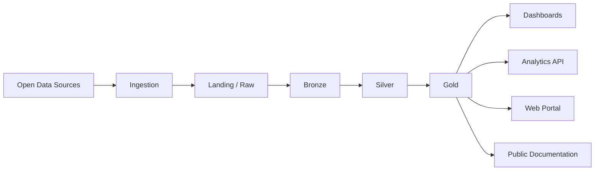

# Architecture Overview

The Open Data Lakehouse Lab follows a modular architecture based on open standards and a multi-cloud strategy.

## High-Level Data Flow

## Architecture Principles

- **Multi-cloud**: Neutrality across cloud providers (Azure, AWS, GCP).
- **Open Standards**: Use of open data formats and protocols.
- **Local-First**: Ability to run the laboratory in a local environment.
- **Data Lakehouse**: Combining the best of data lakes and data warehouses.
