# Architecture Overview

The Open Data Lakehouse Lab follows a modular architecture based on open standards and a multi-cloud strategy.

## Current Local Flow

The current local data flow supports multi-resource execution for the supported Meteocat resources and optional landing contract validation.

```mermaid
flowchart LR
    A[Dataset Catalog<br/>meteocat-weather selected] --> B[Ingestion<br/>landing JSON]
    B --> C[Landing Quality<br/>JSON & optional contracts]
    C --> D[Transformation<br/>bronze JSONL]
    D --> E[Bronze Quality<br/>JSONL validation]
    E --> F[Silver Transformation<br/>silver JSONL]
    F --> G[Silver Quality<br/>JSONL validation]
    G --> H[Orchestration<br/>run-summary.json]
    H --> I[Observability<br/>JSON and Markdown reports]
    I --> J[Dashboards<br/>static HTML]
```

### Resource Mapping

| Resource | Silver entity |
| --- | --- |
| `stations-metadata` | `stations` |
| `variables-metadata` | `variables` |
| `measured-variable` | `measurements` |

### Flow Details

- **Local-First**: The entire flow runs on a local machine without requiring cloud credentials or active cloud services.
- **Landing Layer**: Data is ingested and stored in **JSON** format.
- **Bronze Layer**: Data is transformed and stored in **JSONL** (JSON Lines) format.
- **Silver Layer**: Data is transformed into a foundation layer and stored in **JSONL** format.
- **Quality**: Automated validation of JSON and JSONL files across Landing, Bronze and Silver.
    - Default mode validates basic landing JSON quality.
    - Optional contract mode validates landing JSON against draft internal contracts and permissive schemas from `datasets-catalog`.
- **Orchestration**: Lightweight, subprocess-based execution generating a `run-summary.json`.
- **Observability**: Generation of human-readable Markdown reports and machine-readable JSON summaries (including quality results).
- **Dashboards**: Visualization of the results using static HTML pages.

### Limitations and Future Work

- **Cloud Deployment**: Real cloud deployment (Azure, AWS, GCP) is not yet implemented.
- **Modeling**: Silver exists as a local foundation. Gold modeling layers are not yet implemented.
- **Storage Formats**: Parquet is not currently implemented but is planned for future evaluation in the Silver/Gold layers.
- **Local Cloud Emulators**: Integration with local cloud emulator candidates is planned for the next milestone.

## Architecture Principles

- **Multi-cloud**: Neutrality across cloud providers (Azure, AWS, GCP).
- **Open Standards**: Use of open data formats and protocols.
- **Local-First**: Ability to run the laboratory in a local environment.
- **Data Lakehouse**: Combining the best of data lakes and data warehouses.
